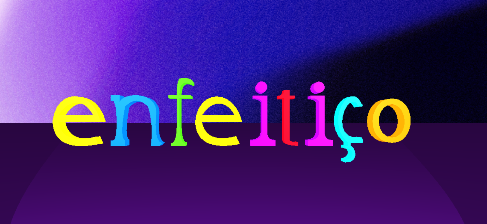
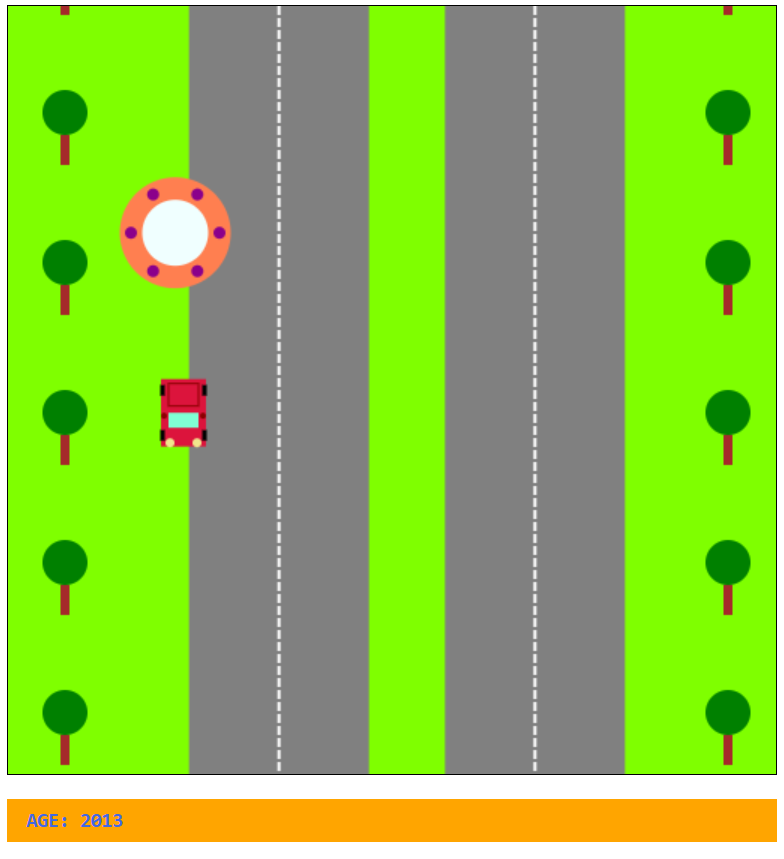
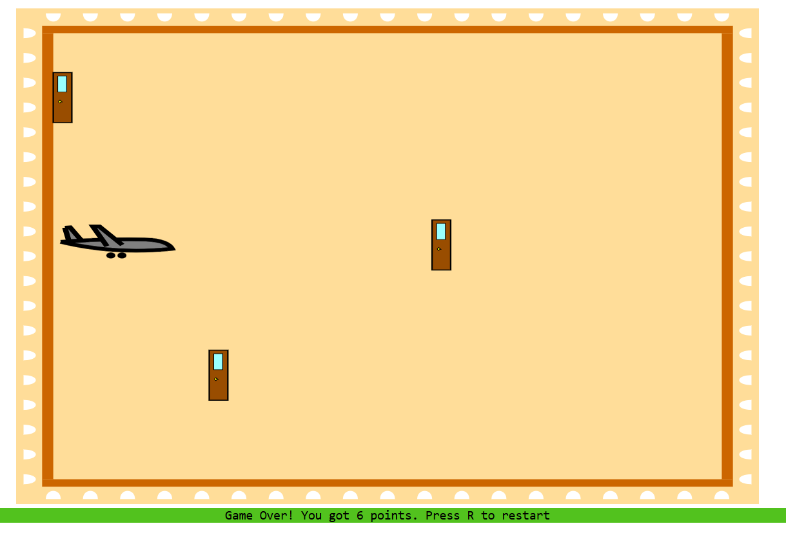
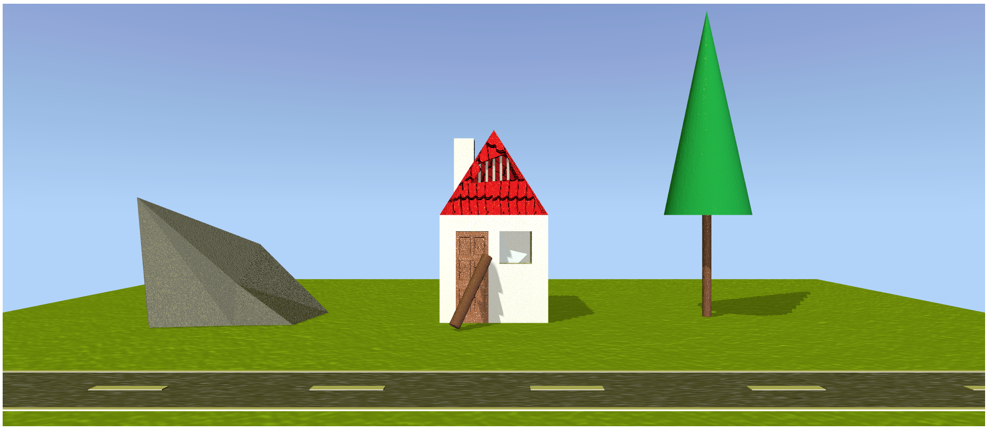

# Computer Graphics

A collection of graphics programming labs developed using Node.js and various Web Graphics standards.

## Repository Structure

```
ComputerGraphics/
├── 3JS/                    # Three.js (WebGL wrapper)
│   ├── assets/
│   │   └── textures/       # Texture images
│   └── src/
│       ├── Animação_3JS.html
│       ├── Animação_3JS.js
│       └── lib/            # Libraries (Three.js)
│
├── C2D/                    # Canvas 2D
│   ├── assets/
│   └── src/
│
├── SVG/                    # Scalable Vector Graphics
│   ├── assets/
│   └── src/
│
├── X3D/                    # Extensible 3D (X3DOM)
│   ├── assets/
│   │   └── textures/       # Material and texture images
│   └── src/
│       ├── Animação.x3d
│       ├── Animação_X3D.html
│       ├── Animação_X3D.js
│       └── lib/            # Libraries (X3DOM)
│
└── README.md
```

## Project Descriptions

### **3JS - "Enfeitiço" (The Spell)**
An animated 3D text visualization displaying the word "Enfeitiço" with individually animated letters.

**Techniques Applied:**
- **Manual Letter Construction:** Each letter (E, N, C, H, A, T, E, D, O) was created manually using Three.js. `ExtrudeGeometry` with custom coordinates and bevel parameters.
- **Texture Mapping:** Applied procedural texture (MagicPattern.png) as background.
- **Material & Lighting:** Used Phong materials with shininess effects, ambient lighting, and multiple spot lights for dramatic shadows.
- **Animation Framework:** Integrated Tween.js for smooth letter animations and camera movement.
- **Camera Controls:** Implemented OrbitControls for interactive 3D exploration.
---

### **X3D - 3D Scene with Landscape**
A declarative 3D scene built with X3DOM featuring a complete outdoor environment with an animated landscape.

**Techniques Applied:**
- **Hierarchical Structure:** Organized multiple scene members (house, roof, doors, windows, gate, chimney, trees, stones) each with individual IDs.
- **Skeletal Animation:** Implemented member-based animation system where each component (roof left/right, walls, door, chimney) has independent translation and rotation properties. <br>&nbsp;
- **Texture Mapping:** Applied PBR (Physically Based Rendering) textures including: <br>&nbsp;
  - Diffuse maps (base colors).
  - Specular maps (shine/reflectivity).
  - Normal maps (surface detail without geometry). <br>&nbsp;
- **Geometry Indexing:** Used IndexedFaceSet for complex shapes (rock geometry, roof structures) with texture coordination.
- **Lighting & Environment:** Added directional light (sun) with rotation animation and gradient background sky.

---

### **C2D - Endless Driving Chase**
A 2D top-down endless driving with follower, demonstrating parallax scrolling and procedural drawing.

**Techniques Applied:**
- **Procedural Drawing:** Hand-coded all visual elements (grass, roads, lines, trees, car) using Canvas 2D API.
- **Parallax Animation:** Implemented depth-based scrolling where road lines and trees move at different velocities based on distance. <br>&nbsp;
- **Compound Objects:** <br>&nbsp;
  - Car with mirrors, lights, wheels, and windshield.
  - Trees with trunks (rectangles) and foliage (circles).
  - Multi-lane roads with continuous marking lines. <br>&nbsp;
- **Collision Detection:** Implemented hit-detection system between car and tree elements.
- **Transform Matrices:** Applied rotation and translation transforms for vehicle components.

---

### **SVG - Battering Ram Gate Game**
An interactive game where the player controls an ariete (battering ram) to break through moving doors.

**Techniques Applied:**
- **Interactive SVG Manipulation:** Dynamically transformed SVG components using translate/scale attributes.
- **Vector-Based Graphics:** Built all game elements as scalable vectors (ariete, doors).
- **Physics Simulation:** Implemented movement system with velocity, acceleration, and boundary constraints.
- **Collision Detection:** Created hitbox-based collision between ariete and doors with game state management. <br>&nbsp;
- **Game Logic:** <br>&nbsp;
  - Multi-phase system (waiting → playing → game over).
  - Dynamic door spawning at random heights.
  - Points calculation based on time elapsed.
  - Keyboard input handling (W/S movement, R restart). <br>&nbsp;
- **DOM Integration:** Used JavaScript to read/write SVG attributes dynamically for real-time updates.

---

## Important Notes

- **The `lib/` folders are required** - they contain the necessary libraries for the projects to work.
- The images below are placeholders. Please run the respective HTML files in each project folder to see the actual animations and interactions in action.

## Visual Results






